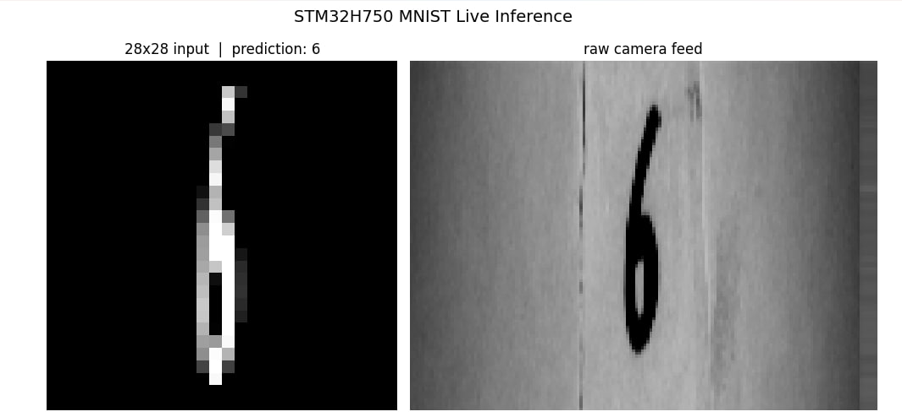

# MNIST Digit Recognizer on STM32H750 via OV7670 + emlearn

A fully embedded ML system — an OV7670 camera captures a handwritten digit on paper, a lightweight MLP neural network runs inference directly on an STM32H750VBT6 microcontroller, and the predicted digit is sent to a PC terminal over UART. No OS, no external ML runtime, no host computation after boot.

---

## Output:



---

## Repository Structure:

```
ai_mnist_stm32_ov2640/
├── code/
│   ├── c/
│   │   └── ai_mnist_stm32_ov2640/         # STM32CubeIDE project
│   │       ├── Core/
│   │       │   ├── Inc/
│   │       │   │   ├── main.h
│   │       │   │   ├── ov7670.h            # OV7670 camera driver header
│   │       │   │   ├── mnist_784_8_10.h    # emlearn generated MLP model
│   │       │   │   ├── eml_net.h           # emlearn runtime headers
│   │       │   │   ├── eml_common.h
│   │       │   │   └── eml_net_common.h
│   │       │   └── Src/
│   │       │       ├── main.c              # capture + preprocess + inference + UART
│   │       │       └── ov7670.c            # OV7670 register init driver
│   │       ├── Drivers/
│   │       └── ai_mnist_stm32_ov2640.ioc   # CubeMX project file
│   │
│   └── python/
│       ├── train_mnist.py                  # MLP training + emlearn export
│       └── uart_viewer.py                  # PC live viewer + prediction display
│
└── README.md
```

---

## Hardware:

```
MCU      : STM32H750VBT6  ---> DevEBox v2.0 board @ 480MHz
Camera   : OV7670         ---> pin-header format, manually wired
USB-UART : CH340N HW-234  ---> 1Mbaud for live streaming
Pull-ups : 2x 4.7KΩ      ---> on SDA and SCL lines
```

---

## Wiring:

```
OV7670 SIOC  ---> STM32 PB6   (I2C1 SCL)
OV7670 SIOD  ---> STM32 PB9   (I2C1 SDA)
OV7670 VSYNC ---> STM32 PB7   (DCMI VSYNC)
OV7670 HREF  ---> STM32 PA4   (DCMI HSYNC)
OV7670 PCLK  ---> STM32 PA6   (DCMI PIXCLK)
OV7670 XCLK  ---> STM32 PA8   (MCO1 12.5MHz)
OV7670 RESET ---> STM32 PC4   (GPIO Output)
OV7670 PWDN  ---> STM32 PA7   (GPIO Output)
OV7670 D0    ---> STM32 PC6   (DCMI D0)
OV7670 D1    ---> STM32 PC7   (DCMI D1)
OV7670 D2    ---> STM32 PC8   (DCMI D2)
OV7670 D3    ---> STM32 PC9   (DCMI D3)
OV7670 D4    ---> STM32 PE4   (DCMI D4)
OV7670 D5    ---> STM32 PD3   (DCMI D5)
OV7670 D6    ---> STM32 PE5   (DCMI D6)
OV7670 D7    ---> STM32 PE6   (DCMI D7)
OV7670 VCC   ---> 3.3V         -------
OV7670 GND   ---> GND          -------
```

> Pull-up resistors (4.7KΩ) are required between 3.3V and both PB6 (SCL) and PB9 (SDA). Without them I2C will not work.

> DevEBox v2.0 has a non-standard 24-pin camera connector — do NOT use it with OV2640 flex cable modules. The pin 1 alignment is inverted and will permanently damage the camera. Use pin-header format cameras with manual wiring instead.

---

## How It Works:

```
OV7670 streams YUV422 pixels via DCMI + DMA ---> frame_buf (38KB in RAM)
        ↓
Extract Y channel (odd bytes) ---> gray_buf (160x120 grayscale)
        ↓
Center crop 90x120 ---> adaptive threshold + contrast stretch + invert
        ↓
Downsample to 28x28 ---> small_buf (784 bytes)
        ↓
Normalize to float[784] ---> emlearn MLP forward pass
        ↓
Predicted digit 0-9 ---> UART TX ---> PC Python viewer
```

**Why invert?** MNIST has white digits on black background. Paper has black digits on white. Inversion is applied during preprocessing so the model sees what it was trained on.

**Why adaptive threshold?** A fixed threshold fails under different lighting. The mean brightness of the center region of the frame is computed per-frame and used as the dividing line between digit and background.

---

## ML Model:

```
Dataset      : MNIST (60K train / 10K test)
Architecture : MLP  784 → 8 → 10
Input        : 28x28 grayscale (784 features)
Framework    : scikit-learn MLPClassifier
Export       : emlearn → pure C header
Activation   : ReLU
Solver       : SGD
Test Accuracy: ~92.8%
Model size   : ~50 KB in flash
Total flash  : ~72 KB / 128 KB
```

The model is exported as a C header with no dynamic allocation — weights are `const float` arrays stored directly in flash. Inference is a matrix multiply + ReLU + argmax, nothing more.

---

## emlearn!

[emlearn](https://github.com/emlearn/emlearn) is what makes this whole project possible on a 128KB flash MCU. It takes a trained scikit-learn model and converts it to a pure C header file — no runtime library, no dynamic memory, no dependencies. The generated header contains the weight arrays and a single predict function. You include it, call it, done.

No TensorFlow Lite, no X-CUBE-AI, no CMSIS-NN — just a header file and arithmetic. This is exactly what embedded ML should look like.

---

## CubeMX Configuration:

```
RCC HSE      : 25MHz crystal                         ---> main clock source
PLL1         : M=5  N=192  P=2                       ---> SYSCLK = 480MHz
MCO1         : HSE / 2 = 12.5MHz on PA8              ---> OV7670 XCLK
DCMI         : 8-bit external sync                   ---> camera interface
               VSYNC high, HSYNC low, PCLK rising
DMA1 Stream0 : DCMI → Memory, word width             ---> frame transfer
I2C1         : Standard mode, PB6 SCL / PB9 SDA      ---> SCCB camera config
USART3       : 1Mbaud async, PB10 TX / PB11 RX       ---> debug + result output
GPIO PA7     : Output Push-Pull                       ---> PWDN
GPIO PC4     : Output Push-Pull                       ---> RESET
```

---

## Software:

### 1 — Train the model

Copy the generated `mnist_784_8_10.h` to `Core/Inc/` in the CubeIDE project.

### 2 — Flash the firmware

Open `code/c/ai_mnist_stm32_ov2640/` in STM32CubeIDE, build and flash.

### 3 — Run the live viewer

The viewer shows two windows side by side — left shows the 28×28 preprocessed input with the predicted digit label, right shows the raw 160×120 grayscale camera feed.

---

## Camera Focus:

The OV7670 has a manually adjustable lens — rotate the lens barrel to focus. For best results place the digit on white paper 15–25cm from the camera, use strong even lighting, and write the digit large and centered in the frame. The center 90×120 region of the 160×120 frame is used for inference.

---

## Main Points:

- DevEBox v2.0 has a non-standard camera connector — pin 1 does NOT match OV7670 flex cable pin 1. Using the connector killed an OV2640 during development.
- OV7670 I2C address is `0x21` (7-bit) → `0x42` write address. RST and PWDN pins must be initialized before the I2C scan or the camera won't respond.
- DCMI VSYNC polarity must be set to High for OV7670 — Low polarity results in `DCMI_SR = 2` (VSYNC flag set) but no frame capture ever triggers.
- I2C SCL on this board is PB6 not PB8 — CubeMX assignment is ground truth, not assumptions.
- External pull-up resistors on I2C lines are mandatory. Internal STM32 pull-ups are too weak for reliable SCCB communication.
- OV7670 Y channel is at odd byte indices in YUV422 output (U Y V Y ordering), not even.
- Adaptive thresholding per-frame handles lighting variation far better than a fixed threshold.
- emlearn `method='inline'` embeds weights directly as C arrays — no heap, no malloc, runs on bare metal with zero dependencies.

---

## Memory Usage:

```
Flash 128KB:
├── HAL + startup + system         ~10 KB
├── OV7670 driver                  ~3  KB
├── Application + preprocessing    ~9  KB
└── emlearn MLP weights            ~50 KB
                                   ──────
                                   ~72 KB / 128 KB

RAM (AXI SRAM):
├── frame_buf  160x120x2 YUV422    ~38 KB
├── gray_buf   160x120 grayscale   ~19 KB
├── small_buf  28x28               ~0.8 KB
├── features   784 floats          ~3  KB
└── Stack + HAL buffers            ~5  KB
                                   ──────
                                   ~66 KB
```

---

## Related Projects

[IRIS_classification_ai_stm32h750](https://github.com/Alimt36/IRIS_classification_ai_stm32h750)

---

by [Alimt36](https://github.com/Alimt36)